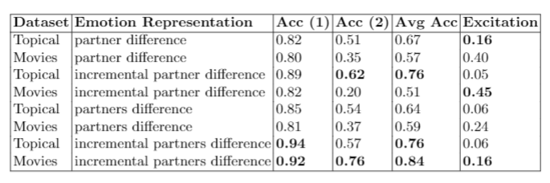

#  Modelling Emotion Dynamics in Chatbots with Neural Hawkes Processes - Part of my PhD work.


This repository presents source code and data used in the paper "Modelling Emotion Dynamics in Chatbots with Neural Hawkes Processes". The paper provides an LSTM-based Hawkes process which can learn hidden representations within a short-length dyadic conversation emotion dynamics. Learning hidden influence patterns in conversations opens the venue for emotional intelligent chatbots where a controller agent can estimate the future consequences of its expressed emotions. We evaluate our model on two public datasets: (1) Cornell Movie-Dialogues, and (2) Topical Chat. 


## Model Architicture


## Model Parameters


## Requirements

### To install requirements:

```setup
pip install -r requirements.txt
```

## Running the Experiments

To regenerate results from the paper or to rerun the whole experiments, first, unzip the data folder in the same parent directory, then follow the below commands and select according to your machine power either CPU or GPU:

## to test

### on GPU


```
python main.py --mode 'test' --gpu 'yes --synthetic_shift_v 1 --model_name [A or B or C D] --mut_excit [based on model name, chose yes or no]' --increment [based on model name select yes or no] --data_path [path to the targetted dataset] --prediction_length 3
```

### on CPU

```
python main.py --mode 'test' --gpu 'no' --synthetic_shift_v 1 --model_name [A or B or C D] --mut_excit [based on model name, chose yes or no]' --increment [based on model name select yes or no] --data_path [path to the targetted dataset] --prediction_length 3

```
## to train

### on GPU

```
python main.py --mode 'train' --gpu 'yes'  --mut_excit [based on desired shift representation, chose yes or no]' --increment [based on based on desired shift representation select yes or no] --data_path [path to the targetted dataset] --drop_out 0.3 --e_input_dim 2 --t_input_dim 1 e_output_dim 2 --t_output_dim 3 --hidden_dim 256 --mlp_dim 32 --seq_length 6 --t_criterion 'mse' --e_criterion 'cross_el' --l_r 0.00001 --optimizer 'adam' --n_layers 1 --batch_size 1 --epochs 35
```

### on CPU

```
python main.py --mode 'train' --gpu 'no'  --mut_excit [based on desired shift representation, chose yes or no]' --increment [based on based on desired shift representation select yes or no] --data_path [path to the targetted dataset] --drop_out 0.3 --e_input_dim 2 --t_input_dim 1 e_output_dim 2 --t_output_dim 3 --hidden_dim 256 --mlp_dim 32 --seq_length 6 --t_criterion 'mse' --e_criterion 'cross_el' --l_r 0.00001 --optimizer 'adam' --n_layers 1 --batch_size 1 --epochs 35

```


## Results

Our model achieves the following performance on the two datasets with each emotion change representation, below are the obtained results as in the paper for the other partner (e.g., human prediction accuracy and mutual excitation captured due to the chatbot actions) :




## Contributing
All contributions welcome! All content in this repository is licensed under the MIT license.


